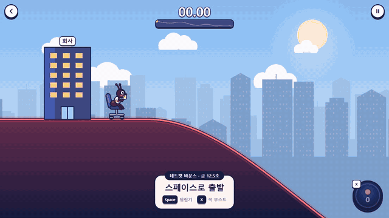

# Chartflip

[English](README.en.md) · **[바로 플레이](https://simpleusername96.github.io/chartflip/)**

주식 차트를 타고 달리는 횡스크롤 타임어택 게임입니다. 사무실 의자에 탄 개미 직장인을 최대한 빨리 집으로 보내세요.

사람의 기획과 디렉션으로 GPT·Claude와 함께 만들었습니다.

Space를 누르면 차트가 상하로 뒤집힙니다. 골짜기에서 뒤집으면 앞의 오르막이 내리막으로 바뀝니다. 코인을 모아 X를 누르는 동안 부스트를 쓰세요. 짧게 눌러 조금씩 쓰거나, 꾹 눌러 더 강하게 가속할 수 있습니다. 점프 중에도 진행 방향으로 부스트가 이어집니다.

| 조작 | 키보드 | 터치 |
|---|---|---|
| 뒤집기 | Space | 왼쪽 아래 뒤집기 버튼 |
| 부스트 | X 누르고 있기 | 오른쪽 아래 버튼 누르고 있기 |

휴대폰에서는 가로로 돌려 플레이하세요. 세로 화면에서 코스를 열면 회전 안내가 표시됩니다.

맵 만들기에서 난이도, 길이, 굴곡과 코인 배치를 조절하고 메달 기준 시간을 정할 수 있습니다. 만든 맵은 저장하거나 파일로 주고받을 수 있습니다.

[MIT License](LICENSE)
